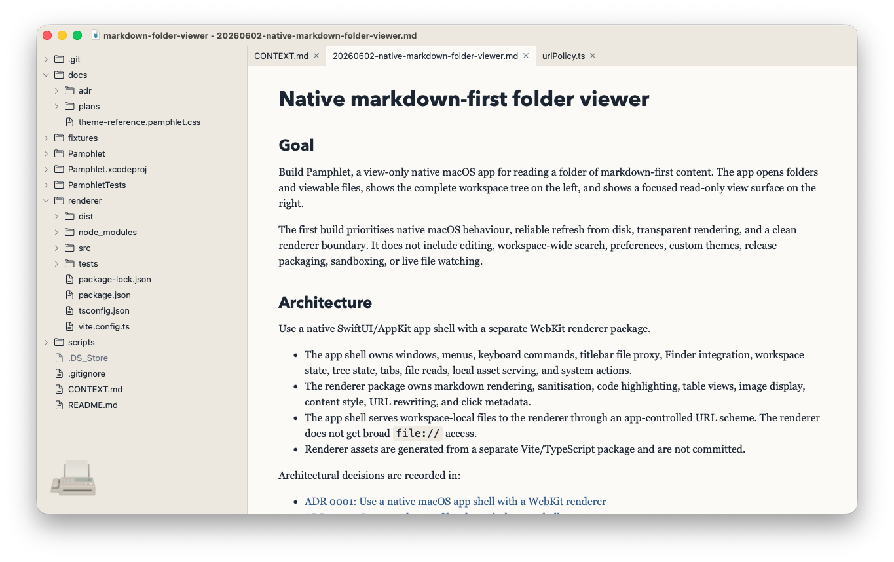
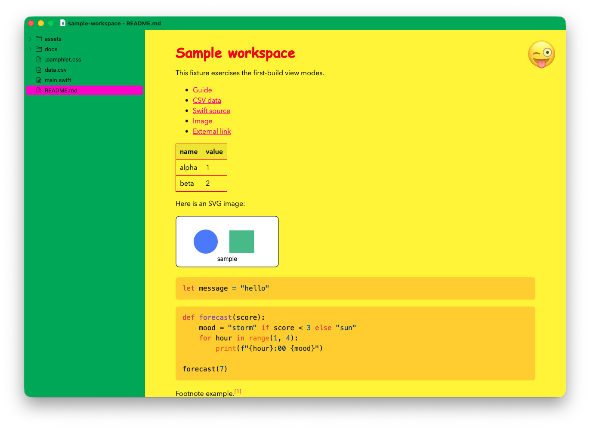

# Pamphlet


Pamphlet is a macOS native, markdown-first folder viewer. 

Sometimes you just need to browse and read a codebase or folder of markdown - now you have a neat little app for that.

The app shell is native SwiftUI/AppKit, and the content pane is powered by a web view.

## Setup

Install development dependencies:

- macOS
- Xcode, including the macOS SDK
- Node.js
- npm

Install renderer dependencies:

```sh
cd renderer
npm install
```

## Build

Build the renderer first:

```sh
cd renderer
npm run build
```

Then open `Pamphlet.xcodeproj` in Xcode, select the `Pamphlet` scheme, and build.

## Launch

Launch the app from Xcode using the `Pamphlet` scheme.

## Use it

- `File > Open…` a markdown file or folder of markdown + code.
- Drag folders or files onto the app icon to open.

## Screenshots





## Themes

Pamphlet supports themes:

- Set a custom theme in any workspace (e.g. brand colours for different clients/projects).
- Choose a default theme for workspaces without a custom theme.
- Add your own custom themes.

Pamphlet themes are CSS files. App-recognised settings use flat `--pamphlet-*` variables; ordinary CSS selectors can style rendered markdown, source, table, and image views.

Workspace themes:

- Add `.pamphlet.css` at the workspace folder root.
- Set `--pamphlet-background`, `--pamphlet-foreground`, and `--pamphlet-accent` for a useful minimal theme.
- Add `--pamphlet-workspace-title: "Banana Corp";` to customise the workspace part of the window title.
- Add `--pamphlet-badge-emoji: "🍌";` or `--pamphlet-badge-image: url("badge.png");` for a decorative watermark.
- See `docs/theme-reference.pamphlet.css` for all options.
- Choose `File > Refresh` after editing it.

Built-in app themes:

- `Default`
- `Default (dark)`
- `Default (light)`
- `Pro`
- `Fun`

Choose the default app theme in `Pamphlet > Preferences…`. Preferences lists built-in themes and user themes separately.

User app themes:

- Preferred: `~/Library/Application Support/Pamphlet/Themes/<theme-name>/theme.css`
- Shorthand: `~/Library/Application Support/Pamphlet/Themes/<theme-name>.css`
- Use Preferences > Reveal Themes Folder to create or open the user themes folder.

Theme files cannot use `@import`, remote fonts, remote theme files, or remote badge images. Font variables can reference fonts installed on the Mac; use Font Book to confirm the family name.

The full copyable theme reference is [docs/theme-reference.pamphlet.css](/Users/rua.haszard/Documents/_active/markdown-folder-viewer/docs/theme-reference.pamphlet.css). Regenerate it after changing theme tokens or renderer hooks:

```sh
cd renderer
npm run generate:theme-reference
```

## Automated tests

Run renderer tests:

```sh
cd renderer
npm test
npm run build
npm run format
cd ..
```

Run macOS app tests from Xcode using the `Pamphlet` scheme.

Generated renderer output in `renderer/dist/` is not committed. If the app build cannot find renderer assets, build the renderer package first.
