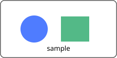

# Sample workspace

This fixture exercises the first-build view modes.

- [Guide](docs/guide.md)
- [CSV data](data.csv)
- [Swift source](main.swift)
- [Image](assets/diagram.svg)
- [External link](https://example.com)

| name | value |
| --- | --- |
| alpha | 1 |
| beta | 2 |

Here is an SVG image:



```swift
let message = "hello"
```

Footnote example.[^one]

[^one]: A fixture footnote.
